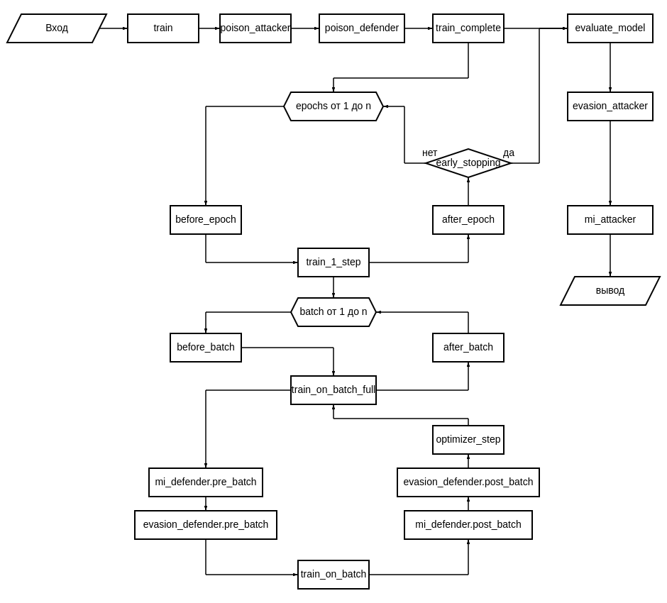

Архитектура бэкенда
********************

.. contents::
    :local:
    :depth: 2

..
    детали и тонкости для разработчика, как помочь внести вклад или расширить библиотеку

    Архитектура кода: модули, классы, потоки данных
        бэк
        фронт
    инструкция по добавлению нового метода (интерпр, атака, защита)
        в рамках текущего апи
        с расширением апи (гетерограф, предск ребер и тп)
    Тесты, кодстайл, линтеры
    Соглашения по docstrings, типизации

Атаки
=====

В фреймворке поддерживаются три типа атак: атаки уклонения, отравления и MI атаки. Атаки отравления модифицируют набор данных, чтобы модель обучилась некорректно. Атаки уклонения направлены на то, чтобы уже обученная модель дала некорректный ответ на определенных данных. MI атаки являются атакой на приватность обученной модели и должны размечать данные на те, которые использовались при обучении модели и те, которые не использовались при обучении. Стоит обратить внимание, что в общем случае постановка MI не ставят перед собой целью восстановления разбиения на все три группы (обучение, валидация и тест).

Все методы атак находится на уровне менеджера модели, так как все методы атак должны применяться до обучения (для атак отравления) или на этапе оценки (для MI атак и атак уклонения).

Базовый класс Attacker
----------------------

Для реализации методов атак и выполнения вспомогательных функций связанных с этим процессом реализован класс `Attacker` (файл ``src/attacks/attack_base.py``), который по умолчанию содержит методы ``attack``, ``dataset_diff``, статический метод ``check_availability`` и магический метод ``__init__``.

Метод ``attack`` является основным, которые собственно реализует саму атаку на данные, которые предоставляются. Этот метод требует переопределения при реализации новой атаки. Метод ``dataset_diff`` отвечает за информацию об изменениях в данных, если метод не предполагает изменения данных, то может не переопределяться. Метод ``check_availability`` нужен, чтобы можно было определить можно ли применить метод атаки на переданную конфигурацию (данных и/или менеджера).

Типы атак
---------

От класса **Attacker** наследуются классы для реализации соответствующих трех типов атак: `PoisonAttacker` (``src/attacks/poison_attacks.py``), `EvasionAttacker` (``src/attacks/evasion_attacks.py``), `MIAttacker` (``src/attacks/mi_attacks.py``). Они являются базовыми классами, от которых наследуются уже конкретные методы самих атак, которые будут более детально описаны в разделах 3-5 данного отчета.

Отдельно отметим, что MI атака и атака уклонения работают не обязательно на всем наборе данных (по умолчанию запускаются на всей тестовой выборке, но посредством белевого тезора маски можно запустить атаку на подмножестве данных датасета. В данном случае маска имеет эквивалентный смысл маскам разбивающие данные набора на обучение, валидацию и тест. Подмножество также подразумевает вершину с ее i-ой окрестностью для задач классификации вершин или i-ый граф для задач классификации графов, а не абсолютно произвольное подмножество данных. Кроме тех случаев, если иная логика не предусмотрена конкретными атаками).

Конфигурации атак
-----------------

Для каждого класса атаки был создан свой собственный класс-конфиг: `PoisonAttackConfig`, `EvasionAttackConfig`, `MIAttackConfig` (файл ``src/data_structures/configs.py``). Стоит отметить, что для созданных во фреймворке специализированных структуры данных была сделана новая папка ``data_structures`` в корне проекта (``src/data_structures``), чтобы все структуры данных были в одном месте. В частности в эту папку были перемещены файлы ``configs.py`` (структуры для создания объектов классов), ``explanation.py`` (структура для хранения результатов методов интерпретации), ``prefix_storage.py`` (структура преффикс-дерева, которая используется для анализа сохраненных данных, моделей, интерпретаций и всего, что сохраняется фреймворком в случае если пути сохранения назначаются по умолчанию).

Пустые атаки
------------

Отдельно стоит упомянуть такие классы атак как: `EmptyPoisonAttacker`, `EmptyEvasionAttacker`, `EmptyMIAttacker`. Эти классы являются специализированными реализациями, которые говорят о том, что соответствующая атак не определена. В некотором смысле это аналог значения ``None``. Более подробно его назначение будет описано далее в этом разделе.

Хранение модификаций графа
---------------------------

Чтобы хранить результаты изменения набора данных в результате атаки и защит реализован класс `GraphModificationArtifact` (файл ``src/data_structures/graph_modification_artifacts.py``), который является специализированной структурой данных.

Структура данных
~~~~~~~~~~~~~~~~

Класс имеет два основных поля ``self.nodes`` и ``self.edges``, которые являются словарями.

Поле ``self.nodes`` содержит три ключа:

* ``"remove"`` содержит список вершин, которые удаляются
* ``"add"`` – словарь вершин, которые добавляются (причем именно словарь, так как при добавлении вершины необходимо не только добавить номер, но и указать значения признаков для новой вершины)
* ``"change_f"`` содержит информацию об изменениях признаков вершин (если меняются только признаки), эта информация также указывается с помощью словаря, так как необходимо указать не только у какой вершины и какой признак надо поменять, но и на что он меняется

Поле ``self.edges`` содержит два ключа:

* ``"remove"`` – информация об удалении ребер
* ``"add"`` – информация о добавлении новых ребер

.. note::
   Ребра в torch_geometric всегда считаются направленными, поэтому если необходимо добавить или удалить ребро, то в списоки необходимо добавить информацию по двум направленным ребрам. Первый индекс указывает на то из какой вершины ребро выходит, второй на то в какую вершину ребро направлено.

Методы класса GraphModificationArtifact
~~~~~~~~~~~~~~~~~~~~~~~~~~~~~~~~~~~~~~~~

Структура данных содержит множество функций, рассмотрим подробнее назначения функций и их групп.

**Методы заполнения:**

Функции ``add_node``, ``remove_node``, ``change_node_feature``, ``add_edge``, ``remove_edge`` отвечают за заполнение соответствующих полей и ключев в структуре данных. Эти методы также имеют множественные вариации, которые позволяют заполнить информацию не по одному ребру или вершине, а сразу по целой группе: ``add_nodes``, ``remove_nodes``, ``change_node_features``, ``add_edges``, ``remove_edges``. Есть еще два метода: ``set_edges`` и ``set_nodes``, которые позволяют заполнить сразу все ключи соответствующего поля.

**Технические методы:**

Структура содержит также три технические статичных метода:

* ``_tensor_to_list`` – конвертация torch тензоров в список
* ``_list_to_tensor`` – из списка формируется torch тензор
* ``to_scalar_str`` – конвертирует индексы разных форматов в строковый тип

**Методы работы с данными:**

* ``to_json`` – преобразует поля класса в json (требуется для сохранения)
* ``from_json`` (статическая) – на основании json файла заполняет и структуру и возвращает заполненный объект класса `GraphModificationArtifact`
* ``clear`` – полностью очищает всю структуру
* ``summary`` – возвращает словарь с указанием количества изменений каждого типа

Интеграция с GeneralDataset
~~~~~~~~~~~~~~~~~~~~~~~~~~~~

Для того, чтобы объекты класса `GeneralDataset` могли взаимодействовать со структурой данных `GraphModificationArtifact`, в классе `GeneralDataset` (файл ``src/base/datasets_processing.py``) был добавлен метод ``apply_modification``, который принимать объект класса `GraphModificationArtifact` и применяет описанные в структуре модификации.