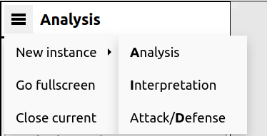
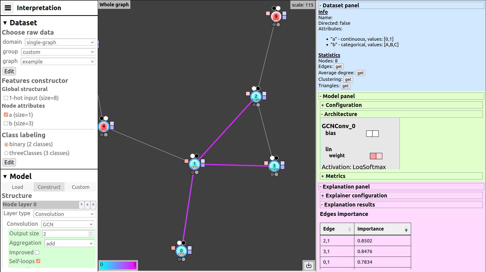
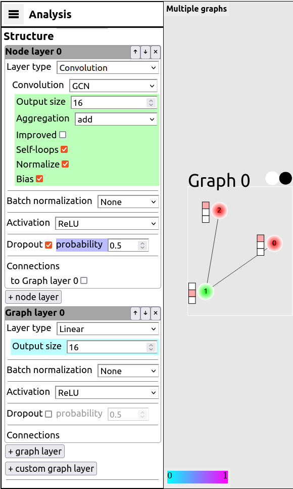
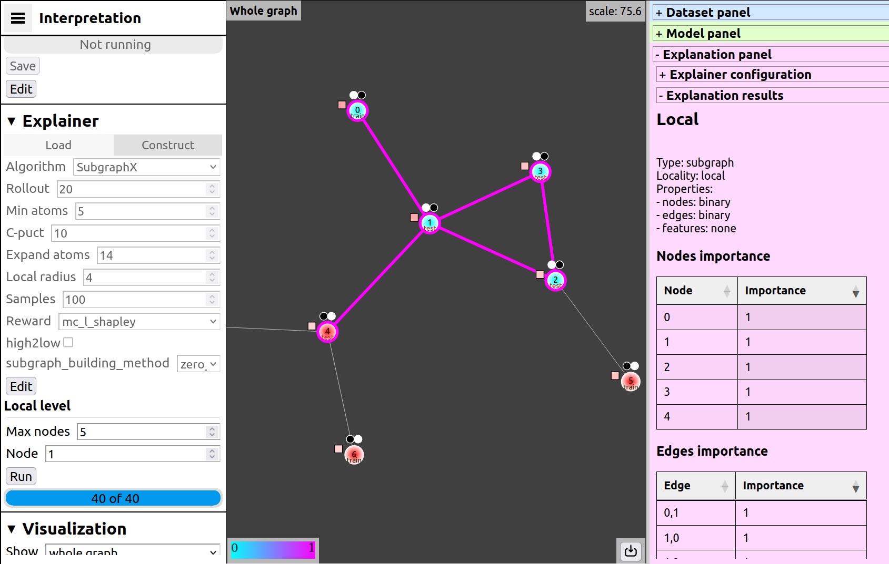
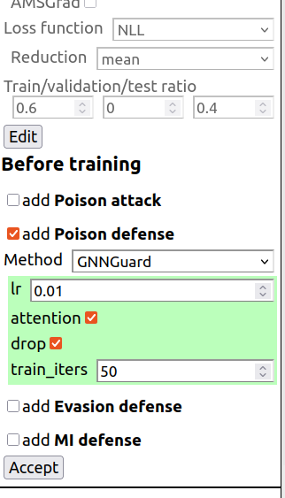
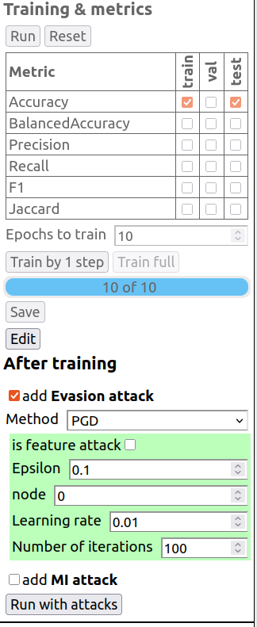

Фронтенд
********

.. contents:: Содержание
   :local:
   :depth: 3

Фронтенд является дополнительным функционалом, дублирующим большинство возможностей бэкенда в виде взаимодействия пользователя с графическим интерфейсом в браузере. Опишем общие сценарии работы и устройство фронтенда, а далее нюансы про менеджер моделей и интерпретацию.

Сценарии использования системы
==============================

Предполагаемые сценарии использования инструмента GNN-AID из браузера можно условно разделить на стандартный сценарий и его расширения. Стандартный сценарий включает:

1. выбор/построение датасета
2. построение/загрузка GNN модели
3. обучение GNN модели

Расширениями стандартного сценария являются:

1. анализ графовых данных
2. интерпретация GNN модели
3. применение атак и защит к GNN модели

На фронтенде можно создавать процесс в отдельной вкладке. Например в одной запустить обучать модель, в другой интерпретацию предыдущей модели, в третьей исследовать атаки.

На фронтенде есть 3 режима, соответствующих расширениям стандартного сценария: 1) Анализ, 2) Интерпретация, 3) Защиты/атаки. По умолчанию запускается режим Анализ, его возможности доступны и в двух остальных.

Стандартный сценарий
====================

1. Выбор/построение датасета
-----------------------------

Пользователь задает датасет: выбирает графы (набор графов), способ построения признаков из атрибутов, задачу и разметку.

Пользователь выбирает способ отрисовки: окрестность вершины или граф целиком (если небольшой). Для датасета, состоящего из набора графов, можно смотреть на 1 или несколько графов. На панели датасета рисуется видимая часть графа, с которой можно взаимодействовать (перемещать вершины, масштабировать) и просматривать параметры вершин (id вершин ВК со ссылкой). На панели анализа можно видеть статистику по датасету: структурные свойства, распределения и т.п. Для каждой вершины/ребра можно увидеть ее атрибуты и признаки.

**Возможности:**

* загрузка графа/графов из хранилища
* разные способы построения признаков из атрибутов
* разные варианты задания разметки: классификация, регрессия (будет реализована на следующих этапах)
* двигание вершин, масштабирование, хождение по датасету
* способы просмотра: окрестность, 1 граф, много графов
* информация о вершинах и ребрах: атрибуты, признаки
* статистика графа: метрики, распределения
* статистика атрибутов: распределения, корреляции

2. Построение/загрузка модели
------------------------------

Пользователь задает архитектуру модели или загружает существующую. 

**Возможности:**

* no-code конструктор модели
* схема архитектуры модели
* меню загрузки модели
* меню загрузки обученной пользовательской модели (созданной вне фреймворка)

3. Обучение модели
------------------

Пользователь задает параметры обучения модели. Выбирает число эпох обучения и метрики. Запускает обучение и наблюдает график метрик онлайн. 

**Возможности:**

* меню с параметрами обучения
* меню запуска обучения (по 1 шагу), выбора метрик
* онлайн отрисовка графиков метрик качества

Расширения стандартного сценария
================================

Р-1. Анализ (по умолчанию)
---------------------------

Это расширение доступно по умолчанию при запуске веб-интерфейса. Актуально, если используются небольшие датасеты и легкие модели с известной архитектурой и весами. В этом сценарии доступна визуализация процесса обучения. Пользователь задает конфигурацию модели или загружает модель с известной архитектурой. Запускает обучение по 1 шагу и наблюдает детали в процессе: матрицы весов с каждого слоя, логиты и предсказания модели для каждой вершины, текущее качество на тренировочной, валидационной и тестовой выборках.

**Возможности:**

* онлайн отрисовка архитектуры и весов GNN модели
* онлайн отрисовка векторов представлений, предсказаний для каждой вершины/ребра, графиков метрик качества

Р-2. Интерпретация
------------------

Расширение влияет на этапе построения модели (самоинтерпретируемость) или после обучения модели (постфактум).

В случае пост-фактум интерпретации пользователь проходит стандартный сценарий и получает обученную модель. Выбирает и запускает алгоритм интерпретации, который выдает локальную или глобальную интерпретацию.

* Важный подграф для предсказания вершины, элементы подграфа (вершины, ребра, признаки) раскрашены на отрисованной окрестности в соответствии с весами значимости;
* Список подграфов-прототипов для глобальной интепретации, отображаются на панели объяснения;
* для локального объяснения в соответствующих подграфах подсвечиваются части и выводятся коэффициенты похожести/близости;
* Выводятся логические выражения на вершины, соответствующие каждому нейрону.

Альтернативно, пользователь строит модель с возможностью самоинтерпретации. Запускает обучение и получает интерпретацию. 

**Возможности:**

* в конструктор модели добавляются доп.слои для самоинтерпретации
* меню построения и запуска метода интерпретации после обучения, загрузки объяснения
* отрисовка объяснения на графе (важный подграф), отображение сопутствующей информации: статистика, прототипы, формулы и т.п.

Р-3. Attacks/Defenses
---------------------

Это расширение позволяет добавлять атаки и защиты модели в пайплайн. Влияет на 2 этапах. До обучения модели пользователь может добавить:

* атаку отравления,
* защиту от отравления,
* защиту от уклонения,
* защиту от вывода членства.

После обучения модели можно добавить:

* атака уклонения
* атака вывода членства

Одновременно можно выбрать по 1 атаке и защите из каждого класса, то есть всего до 6. Результатом атаки отравления или уклонения является модификация датасета, которую можно отобразить на панели отрисовки датасета. Также пользователю интересны изменения метрик работы модели, их можно увидеть на панели информации об атаках/защитах.

Основные элементы веб-интерфейса
================================

Графический интерфейс как веб-страница для пользователя состоит из 3 частей: слева панель меню, в центре панель отрисовки датасета, справа информационные панели о датасете, модели, результатах интерпретации, атак и защит. Рисунок представляет скриншот страницы после выбора датасета, обучения модели и запуска метода интерпретации. Большая часть информации не видна на скриншоте, она доступна при прокрутке соответствующих панелей.

.. todo:: показать где какая панель

**Рисунок** — Скриншот веб-интерфейса в режиме интерпретации. Слева панель меню с выбором датасета, модели (частично) и т.д. (остальные элементы видны после прокрутки вниз). По центру визуализация графа с дополнительной информацией вокруг вершин и результатами объяснения классификации вершины номер 1 в виде сиреневых ребер в ее окрестности. Справа информационные панели, сверху вниз: о датасете, о модели, об интерпретации.

Далее опишем три части более подробно.

Панель меню
-----------

С левой части страницы располагается панель меню со следующими разделами меню:

* Кнопка меню с выбором режима — расширения сценария — Analysis, Interpretation, Attack/Defense,
* Dataset — загрузка датасета в инструмент,
* Model — загрузка, построение, обучение GNN модели,
* Explainer — загрузка или инициализация и запуск метода интерпретации,
* Visualization — управление отображением датасета

В зависимости от выбранного режима (по умолчанию Analysis, стандартный сценарий), набор остальных элементов немного меняется. Режим Analysis является основным, остальные два предлагают различные дополнительные возможности. В режиме Interpretation в панели меню и информационной панели появляется раздел Explainer. В режиме Attack/Defense в панели меню появляются элементы для выбора атак и защит, в информационной панели соответствующий раздел с результатами (на данном этапе не реализованы).

Dataset
~~~~~~~

В начале работы пользователю предлагается выбрать датасет исходя из имеющихся в системе. Они включают как доступные по умолчанию, так и созданные/загруженные пользователем средствами бэкенда. Все датасеты из директории будут отображены в виде иерархического выбора, соответствующего папочной структуре. Например, чтобы выбрать популярный датасет Cora, нужно пройти ptg-library-graphs -> Homogeneous -> Planetoid -> Cora. При наведении на название можно увидеть всплывающее окно с краткой инфо о числе графов, вершин, направленности ребер - в случае, если датасет уже использовался. После нажатия на имя датасета, выбор фиксируется (его можно увидеть в текстовом поле "Selected:" ниже), а нажатие Accept начнет загрузку датасета. После этого структурная часть отрисуется на панели отрисовки датасета.

Далее появляются опции по выбору вариативной части датасета: признаков (способа их построения из атрибутов), разметки и решаемой задачи. При нажатии кнопки Accept на бэкенде формируются признаки, передаются на фронтенд и отображаемый граф приобретает разметку на классы (вершины раскрашены в цвета) и признаки вершин; датасет считается выбранным. Кнопка Edit сбрасывает признаки и разметку, кроме того, сбрасываются все, что зависит от датасета: текущая модель и объяснения.

Visualization
~~~~~~~~~~~~~

Раздел visualization формируется после загрузки структурной части датасета и регулирует отрисовку датасета. В него входят:

* выбор области просмотра: neighborhood (2я окрестность), whole graph (целый граф) или all graphs (в случае датасета из множества графов). При выборе neighborhood появляются селектор Node (на какой вершине центрировать) и выбор глубины окрестности (от 1й до 4й).
* выбор отображения (layout, алгоритм расположения вершин)
  
  * random - случайное расположение, экономит ресурсы в случае большого графа
  * force - силовой алгоритм. Рядом кнопка остановки/включения layout, заморозка перерасчет позиций вершин удобна для ручного изменения их позиций.

* флаги отрисовки сопутствующих элементов для каждой вершины: признаки вершин, метки классов, предсказания модели, эмбединги модели (вектор с последнего слоя), train/validation/test маска.
* флаг раскраски вершин в цвета классов (спектр равномерно разбивается на число классов).

.. todo:: скрин пример

Model
~~~~~

После выбора датасета переходим в раздел создания и управления моделью. На первом этапе доступны 3 вкладки — Load, Constructor и Custom. В Load селекторы генерируются иерархически в соответствии с вложенной структурой, описывающей доступные в хранилище модели для выбранного датасета. При выборе последнего селектора появляется кнопка Accept, ее нажатие ведет к загрузке модели и на панели модели отображается информация о ней. Вкладка Custom обладает схожим функционалом, только позволяет загружать созданные вне фреймворка модели.

В Constructor открывается конструктор для построения модели на основе библиотеки PyTorch-Geometric. Он позволяет создавать основные архитектуры графовых сетей, реализуемые с помощью библиотеки torch. В конструкторе сначала предлагается создать архитектуру модели, затем заполнить параметры менеджера моделей: оптимизатор и его параметры, функцию потерь, размер батча, разбиение на train/validation/test и т.д., после этого задать измеряемые метрики и число эпох обучения. Далее появляется кнопка старта обучения, которая запускает процесс на бэкенде. По ходу получения информации о весах модели и значений метрик, они отображаются на информационной панели справа.

Explainer
~~~~~~~~~

Доступен в режиме Interpreation после тренировки модели. В разделе интерпретации (эксплейнера) так же доступны 2 вкладки — Load и Constructor. В Load подразделы генерируются иерархически в зависимости от состава структуры, описывающей доступные в базе методы для выбранного датасета и загруженной модели. При выборе последнего селектора и нажатии Accept загружается объяснение и на панели интерпретации отображается информация о нем. Кнопка Edit сбрасывает выбранный метод и результат объяснения. Постфактум объяснение отрисовывается в панели отрисовки датасета: подсвечивается важный подграф и вершины.

В Constructor появляются селекторы алгоритма, затем его параметров и номера вершины в случае локального объяснения.

Before train
~~~~~~~~~~~~

Доступен в режиме Attacks/Defenses, появляется после определения параметров менеджера модели, перед тем как приступить к параметрам обучения. Пользователь имеет возможность добавить:

* атаку отравления
* защиту от отравления
* защиту от уклонения
* защиту от вывода членства

Для каждого элемента из этого списка можно выбрать один из доступных методов и задать его параметры, или же не выбирать ничего. На рис. показан скриншот из этой части меню. Для примера там выбрана защита от отравления GNNGuard.

После нажатия кнопки Accept, выбранные параметры фиксируются и пользователь переходит к модулю обучения модели, как и ранее. При этом выбранные методы будут применены согласно их функциям - модифицируют датасет и/или архитектуру модели.

After train
~~~~~~~~~~~

В режиме Attacks/Defenses, после окончания обучения пользователь фиксирует результат нажатием кнопки Accept и переходит ко второму модулю атак-защит. В этом модуле доступен выбор

* атака уклонения
* атака вывода членства

Опять же, можно выбрать по одному доступному методу для каждого элемента из списка. Пример приведен на рис. 4 с выбранной атакой уклонения PGD. После этого нажав кнопку ``Run with attacks`` выбранные методы атак применятся к обученной модели и пользователь увидит обновленные метрики в правой части панели, где находятся метрики обучения модели.

Панель отрисовки датасета
--------------------------

На панели датасета рисуется интерактивный граф. Пользователь может масштабировать холст, перетаскивать вершину или холст целиком. При увеличении масштаба размер вершины и сопутствующих элементов растет медленнее, чтобы разглядеть мелкие детали, но отделить вершины друг от друга. При масштабе менее 30 при режиме whole graph включается light режим: рисуются только контуры ребер на темном фоне. При перетаскивании вершины начинает работать алгоритм расположения вершин, если он не заморожен. В углах отображается дополнительная информация при работе с датасетом:

* В левой верхней части — информация о выбранной вершине (доп.инфо и атрибуты). В случае режима neighborhood еще размеры окрестностей.
* В левой нижней части — легенда цветовой карты для объяснений.
* В правой верхней части — отладочная информация (масштаб).
* В правой нижней части — кнопка скриншота, сохраняет SVG изображение с полной видимой частью в файл.

Граф рисуется примитивами SVG — вершины, ребра и их сопутствующие элементы. Вершина в базовом состоянии — белый круг с номером (всегда от 0 до N-1). Сопутствующие элементы (satellites) вершины включают:

* признаки — колонка квадратов с левой стороны, либо белый квадрат, признаки показываются при наведении. Цветовая карта bwr (красно-синий)
* метки класса вершины — круги сверху по числу классов. Все белые, кроме одного, соответствующему классу (либо все белые если класс не задан).
* эмбединги модели — колонка квадратов с правой стороны с цветовым кодированием bwr.
* предсказание модели — круги снизу по числу классов. Кодирование цветом от белого (0) к черному (1 — для удобства сравнения с исходной меткой.
* train/validation/test маска — цветная подпись в нижней части круга вершины.

Ребро в базовом состоянии — серого оттенка отрезок или дуга со стрелкой (SVG path или arc). Толщина 1 для целого графа или набора и переменная для окрестности в зависимости от удаленности от центральной.

Отображение объяснения. Элементы объяснения постфактум — цветные вершины и цветные ребра. Кодирование важности выполнено цветом. Для ненаправленного графа объяснение может быть направленным.

Информационная панель
---------------------

Панель информации о датасете
~~~~~~~~~~~~~~~~~~~~~~~~~~~~~

Находится справа сверху. Отображается метаинформация о датасете: название, размер, направленность, атрибуты с их типами и возможными значениями. Доступны также статистики о графе, которые будут вычислены при нажатии на кнопку возле их названия: число вершин и ребер, средняя степень, коэффициент кластеризации, диаметр, распределение степеней и другие.

Панель информации о модели
~~~~~~~~~~~~~~~~~~~~~~~~~~~

Находится справа вторая сверху. Отображается:

* описание модели — значения параметров из конструктора или из загруженной.
* ее архитектура — картинки матриц весов с цветным кодированием (при наведении показывается точное значение), функции активации.
* статистика обучения — кривая обучения (в случае создания модели из конструктора) или значения метрик на датасете (в случае загруженной).

Панель информации об интерпретации
~~~~~~~~~~~~~~~~~~~~~~~~~~~~~~~~~~~

Находится справа третья сверху. Отображается:

* описание эскплейнера — значения параметров из конструктора или из загруженного.
* информация об объяснении. Для постфактум методов это тип (важный подграф, прототип и т.п.), локальность, свойства и содержание: для важного подграфа — таблицы со значениями важности для вершин, ребер, признаков. Для ProtGNN это графы прототипов, для NeuralAnalysis это формулы для каждого объясняемого нейрона.

Панель информации об атаках/защитах
~~~~~~~~~~~~~~~~~~~~~~~~~~~~~~~~~~~~

.. todo:: описание панели атак/защит