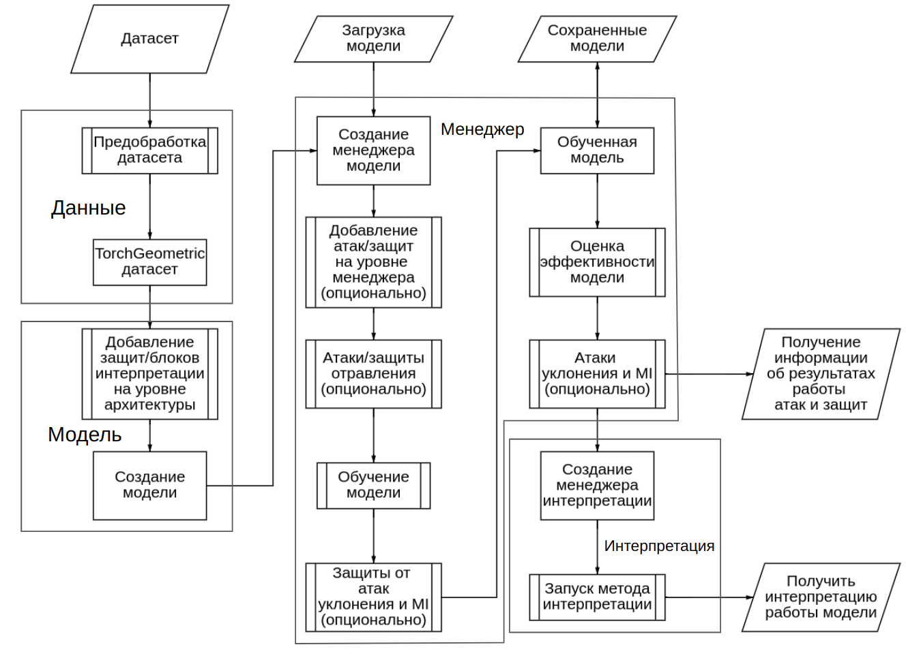

Пайплайн работы
***************

.. contents::
    :local:

Весь пайплайн состоит из 4 основных блоков: подготовка данных, создание модели, работа с моделью до получения финальной обученной модели и интерпретация работы обученной модели. Поговорим о каждом этапе чуть подробнее, максимально полная информация содержится в других разделах документации, на которые далее будут указаны ссылки.

**Этап 1. Подготовка данных**

На этом этапе необхзодимо сказать фреймворку где находятся ваши &quot;сырые&quot; данные, правильно их подготовить, чтобы фреймворк мог использовать для создания объекта датасета в унифицированном формате GeneralDataset. После этого подготовленный датасет готов работе с ним. Подробнее можно прочитать в разделе User guide - datasets, о том с какими форматами он может работать, как и где должны находится ваши данные, какие у полученного датасета есть и так далее.

**Этап 2. Создание модели**

На этом этапе необходимо подготовить класс модели и определить ее архитектуру, для этого есть три опции:

1.  Разработать модель на базе класса FrameworkGNNConstructor на базе бекенда, подробнее описано в разделе User guide - backend
2.  Разработать модель на базе класса FrameworkGNNConstructor на базе фронтенда в no-code режиме, подробнее описано в разделе User guide - frontend
3.  можно самостоятельно написать код модели переопределив класс FrameworkGNNConstructor или даже более общий класс GNNConstructor, об этом процессе можно подробнее прочитать в разделе Dev guide - extension

**Этап 3. Обучение модели**

Процесс получения обученной модели включает задействование всех атакующих и защитных методов, перечень стандартных действий над моделью задается в классе GNNModelManager. Если пользователь хочет воспользоваться готовыми решениями для определения всех функций, то необходимо воспользоваться классом FrameworkGNNModelManager. Также для определенных методов интерпретации, которые работают, например, со специфичными слоями можно переопределить этот класс в качестве примеров можно использовать класс ProtGNNModelManager. Также можно переопределить GNNModelManager, что даст больше свободы действия, но может нарушить совместимость с определенными методами атак, защит и интерпретации

После выбора  менеджера модели до обучения можно задать атаку и защиту от отравления. Они применяются до процесса обучения, так как они не задействуют информацию о модели и работают с данными напрямую. Далее идет процесс обучения, который может быть расширен методами защиты от атак уклонения и атак на приватность. Эти методы можно разделить на pre\_batch, post\_batch и гибридные методы. pre\_batch методы модифицируют данные в batch. Например, расширяя атакованными примерами как это делает состязательное обучение. post\_batch методы модифицируют расчет функции потерь, модифицируют градиенты и так далее. Пример, это метод защиты посредством регуляризации градиентов. Гибридные методы взаимодействуют с данными и моделью как до так и после обучения на батче.

После обучения модели ее необходимо оценить, на этом этапе можно оценить модель не только на обычных данных, но и на атакованных с помощью методов уклонения или провести атаку на приватность.

Также можно создавать свои методы атак и защит, как это делать описано в разделе Dev guide - extension

**Этап 4. Интерпретация**

Для этого надо выбрать метод интерпретации, после чего будет создан объект класса FrameworkExplainersManager, который отвечает за сохранение, загрузку, запуск метода интерпретации и так далее. Там фиксируется выбранный метод интерпретации после чего можно запустить процедуру получения результатов интерпретации.

**PS** При необходимости всегда можно вернутся на один шаг назад за счет исползование MLOps подходов, которые сохраняют конфигурацию запуска каждого эксперимента и обеспечивают версионирование всех экспериментов.
