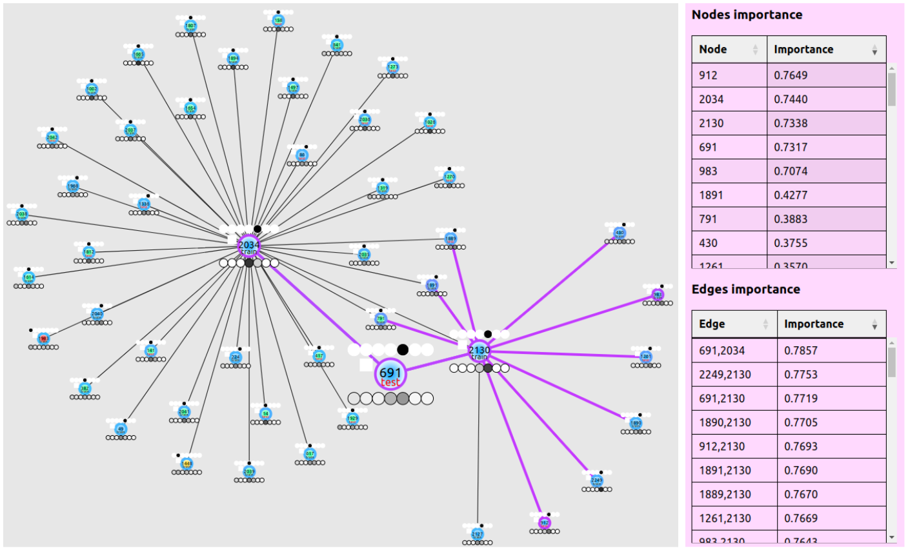

# Interpreting a GNN Model

This experiment demonstrates how to interpret the behavior of a trained graph neural network (GNN) using the built-in interpreter GNNExplainer.
GNNExplainer allows you to determine which nodes, features, and connections influenced the model's decision making.
The GNN-AID framework supports different interpreters.
This example uses GNNExplainer. You can easily change the interpreter in the configuration if you want.

---

## Folder contents
- `gnn_explainer_example.py` — script for training GNN.
- `run_example.sh` — script for running the experiment.
- `imgs/` — folder with example of interpretation.
- `README.md` — description of the experiment.

---

## Quick start

Run:
```bash
  bash run_example.sh
```

The script trains a GNN model on the Cora dataset and then runs the GNNExplainer interpreter to get a local interpretation for a particular node.

---

## Interpretation results

The results of interpretation are automatically saved in the ./explanations folder. 
If you are using the web interface, you will see the resulting interpretation in a similar form:


  
  <br>
  <sub>Pic. 1. The result of the GNNExplainer algorithm on the Cora dataset (interpretation of the model's prediction for vertex 691).</sub>

The algorithm highlighted influential edges and vertices in the graph. On the right side of the image, you can see the importance indicator 
for the highlighted vertices and edges.


